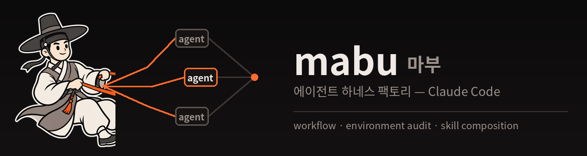

<p align="center">
  
</p>

<p align="center">
  
  <a href="LICENSE"></a>
  
  
  
</p>

# mabu (마부) — The Agent Harness Factory

**English** | [한국어](README_KO.md)

> Say **"build a harness for this project"**, and one sentence of domain description becomes
> agent definitions (`.claude/agents/`) + skills (`.claude/skills/`) + a **deterministic
> Workflow orchestration script** (`workflows/`).

## The Name

**Mabu** (마부, 馬夫 — pronounced *mah-boo*) is the Korean word for a **coachman**: the person
who drives harnessed horses. It's the natural name for this tool, because "harness" was never
a software word to begin with — it's horse tack. Someone has to fit the harness, pick the
horses, and hold the reins. That someone is the mabu.

| The coachman's world | This tool |
|---|---|
| Horses | Agents — the power and the judgment come from them |
| Harness (tack) | Agent definitions + skills — the gear that turns horsepower into work |
| Reins | The Workflow script — the hand that holds order, parallelism, and loop bounds |
| Destination | Your request |

The mabu never tries to be a horse. The horses do the running; the mabu sets the course.

## Core Idea — judgment in agents, flow in scripts

Leave "who does what next" to model discretion and every run takes a different path. The
orchestration this factory generates lets JavaScript enforce order, parallelism, loop bounds,
and output schemas, while models handle only the judgment inside each step. What this choice
actually buys you:

- **Reproducibility** — the same request runs the same path. When something breaks, open
  `journal.jsonl` (a record of every agent's actual return value) and point at the failing
  step. A harness is something you run repeatedly; this difference compounds
- **Cost** — an agent spawns with exactly the context it needs, then disappears. No
  message round-trips between agents, no idle teammates holding context. The structure
  that turns local convenience into global cost never gets built
- **Stability** — Workflow is an official feature. The factory's default never rests on
  a feature behind an experimental flag
- **You don't lose the value of debate** — most of what agent-to-agent discussion buys is
  "a rebuttal from a different angle." That is implemented asynchronously as
  generate → adversarial verify → synthesize, with a reproducible control flow

For the rare case where real-time interaction itself drives output quality, team mode is
supported too — but only when the Phase 0 environment audit confirms teams are enabled.

## Key Features

- **Environment audit first** — before designing anything, check Workflow availability,
  team activation, and the installed-skill inventory. Designs that assume tools that
  don't exist are the #1 cause of harness failure
- **Deterministic orchestration** — fan-out, generate-verify loops, retries, and schema
  validation enforced by a Workflow script. Interrupted runs resume from the last
  completed step via `resumeFromRunId`
- **Skill composition** — proven third-party skills (superpowers, paperthin, eli5,
  ponytail) get attached to agents via the `skills:` preload field, following a
  task-type mapping. On machines without them, agents degrade gracefully to a one-line
  principle
- **Task-aware model assignment** — judgment-heavy work gets higher tiers / high effort,
  mechanical work gets haiku / low. The default is `inherit`, respecting the user's
  session choice
- **Verification built in** — trigger tests (should / should-NOT near-miss queries),
  with-skill vs without-skill comparison runs, dry runs, and boundary-crossing QA
- **An evolving system** — feedback flows back into agents, skills, and workflow scripts,
  tracked in a CLAUDE.md change log. Follow-up requests ("redo", "fix", "just re-run X")
  and partial resumption are supported

## Workflow

```
Phase 0: Status & environment audit (execution means + installed-skill inventory)
    ↓
Phase 1: Domain analysis
    ↓
Phase 2: Architecture design (Workflow / subagents / teams)
    ↓
Phase 3: Agent definition generation (.claude/agents/)
    ↓
Phase 4: Skill sourcing → generation (.claude/skills/)
    ↓
Phase 5: Orchestration (workflows/*.workflow.mjs)
    ↓
Phase 6: Validation & testing
    ↓
Phase 7: Evolution (feedback + change log)
```

## Installation

### As a plugin

```shell
/plugin marketplace add ParkBeomMin/mabu
/plugin install mabu@mabu-marketplace
```

### As a global skill

```shell
git clone https://github.com/ParkBeomMin/mabu
cp -r mabu/skills/harness ~/.claude/skills/   # copy, don't symlink
```

## Structure

```
mabu/
├── .claude-plugin/
│   ├── plugin.json                   # Plugin manifest
│   └── marketplace.json
├── skills/harness/
│   ├── SKILL.md                      # The Phase 0–7 workflow
│   └── references/
│       ├── agent-design-patterns.md  # Execution modes, patterns, full agent frontmatter
│       ├── orchestrator-template.md  # Workflow script + entry-skill templates
│       ├── skill-composition.md      # Sourcing third-party skills — mapping, traps, portability
│       ├── skill-writing-guide.md    # Descriptions, body style, skill frontmatter
│       ├── skill-testing-guide.md    # With/without comparison, trigger verification
│       ├── qa-agent-guide.md         # Boundary-crossing QA
│       └── harness-examples.md       # Two production harness examples
├── LICENSE / NOTICE
└── README.md
```

## Usage

Trigger it with prompts like:

```
Build a harness for this project
Set up an agent pipeline for stage production
Design a multi-agent review harness
Audit my harness / add one more agent
```

### Execution Modes

| Mode | When | Means |
|------|------|-------|
| **Workflow** (default) | Multi-step work whose control flow can be drawn in advance | `agent()` / `pipeline()` / `parallel()` |
| Subagents | 1–2 delegations with human judgment between steps | the `Agent` tool |
| Agent teams (conditional) | Real-time mutual debate drives quality **and** teams are enabled | auto team formation + `SendMessage` |

### The Composition Ecosystem — skills mabu attaches for you

| Agent task | Attached skill | Source |
|---|---|---|
| Design divergence | `superpowers:brainstorming` | [superpowers](https://github.com/obra/superpowers) |
| Debugging / QA | `superpowers:systematic-debugging` + `verification-before-completion` | superpowers |
| Implementation | `superpowers:test-driven-development` | superpowers |
| Plan kill-testing | `paperthin:hate` (verifier agents only) | [paperthin](https://github.com/LilMGenius/paperthin) |
| Acceptance smoke test | `paperthin:shower` · `factchk` | paperthin |
| Docs & skill hygiene | `paperthin:debloat` · `re0` · `ssotize` | paperthin |
| Code minimalism | `ponytail` — **via `skills:` preload only** (measured 0 self-activations) | [ponytail](https://github.com/DietrichGebert/ponytail) |
| User-facing reporting | `eli5` | [ELI5](https://github.com/DreambigOu/ELI5) |

Skills that aren't installed never go into `skills:` (ghost references die silently) —
instead a one-line principle lands in the agent body, so the direction survives.
Details: [skill-composition.md](skills/harness/references/skill-composition.md)

## Use Cases — try these prompts

**Game content factory (generate-verify loop)**
```
Build a harness that produces stages for a persuasion game. A scenario writer
drafts each stage, a balance tester actually plays it three times to verify
difficulty, and failures loop back to the writer with the findings — two
revisions max.
```

**Multi-format content (fan-out pipeline)**
```
Build a harness that takes a seminar recording and produces a summary, card
news, an infographic, and slides. Assign cheap models to mechanical steps like
transcription and better models to summarization, and run the four outputs
in parallel.
```

**Code review (fan-out + adversarial verify)**
```
Build a code review harness for this repo. Sweep architecture, security,
performance, and style in parallel, have a dedicated rebuttal agent filter
the findings, then merge into a single report.
```

**Research (collect → verify → synthesize)**
```
Build a deep-research harness. Collector agents fan out across different
angles, and only findings that pass a factchk gate make it into the final
report.
```

## Output

What mabu generates in your project:

```
your-project/
├── .claude/
│   ├── agents/          # Agent definitions (with skills: preloads)
│   └── skills/          # Domain skills + the orchestrator entry skill
├── workflows/           # *.workflow.mjs — the source of truth for control flow
├── _workspace/          # Intermediate artifacts (audit trail)
└── CLAUDE.md            # Harness pointer + required skills + change log
```

## FAQ

<details>
<summary><b>Q. What happens on machines without the composed skills (superpowers etc.)?</b></summary>

**A.** mabu never copies or installs third-party skills. At generation time it checks the
inventory: ① if installed, the skill is preloaded via `skills:`; ② if not, that skill's core
principle lands as one line in the agent body. Direction survives, depth degrades — a graceful
fallback. Principle-style skills (ponytail) lose almost nothing; process-style (superpowers)
and data-style (eli5) are worth installing. The generated CLAUDE.md's "required skills" line
tells you what's worth adding.
</details>

## Requirements

- Claude Code **v2.1.178+** (the Workflow tool)
- Optional: `CLAUDE_CODE_EXPERIMENTAL_AGENT_TEAMS=1` (for team mode)
- Optional: [superpowers](https://github.com/obra/superpowers) · [paperthin](https://github.com/LilMGenius/paperthin) plugins (for the full composition mapping)

## License

Apache 2.0. The methodology descends from [revfactory/harness](https://github.com/revfactory/harness) — attribution in [NOTICE](NOTICE).
