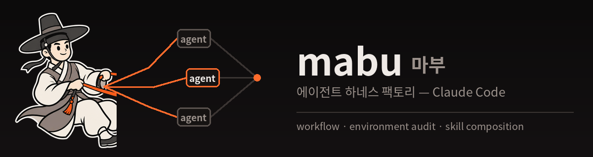

<p align="center">
  
</p>

<p align="center">
  
  <a href="LICENSE"></a>
  
  
  
</p>

# mabu (마부) — 에이전트 하네스 팩토리

[English](README.md) | **한국어**

> **"이 프로젝트에 하네스 만들어줘"** 한 문장이면, 도메인 설명이 에이전트 정의(`.claude/agents/`) + 스킬(`.claude/skills/`) + **결정론적 Workflow 오케스트레이션 스크립트**(`workflows/`)로 바뀐다.

## 왜 '마부'인가

하네스(harness)는 원래 말에 채우는 **마구**다. 마구를 짓고, 말을 고르고, 고삐를 쥐는 사람이 마부다. 이 도구가 하는 일이 정확히 그것이다.

| 마부의 세계 | 이 도구 |
|---|---|
| 말 | 에이전트 — 힘과 판단은 말에게서 나온다 |
| 마구(하네스) | 에이전트 정의 + 스킬 — 말의 힘을 일로 바꾸는 장구 |
| 고삐 | Workflow 스크립트 — 순서·병렬·상한을 쥐는 손 |
| 행선지 | 사용자의 요청 |

마부는 말이 되려 하지 않는다. 달리는 건 말이고, 마부는 길을 정한다.

## 핵심 관점 — 판단은 에이전트에, 흐름은 스크립트에

"누가 다음에 뭘 하나"를 모델 재량에 두면 실행마다 결과가 바뀐다. 이 하네스가 만드는 오케스트레이션은 순서·병렬·루프 상한·산출물 스키마를 JavaScript가 강제하고, 모델은 각 단계 안의 판단만 맡는다. 이 선택이 실제로 갈라놓는 것:

- **재현성** — 같은 요청은 같은 경로로 돈다. 깨지면 `journal.jsonl`(각 에이전트의 실제 반환값 기록)을 열어 어느 단계가 깨졌는지 짚는다. 하네스는 반복해서 돌리는 물건이라 이 차이가 누적된다
- **비용** — 필요한 순간에 필요한 컨텍스트만 든 에이전트가 뜨고, 끝나면 사라진다. 에이전트 간 메시지 왕복도, 놀면서 컨텍스트를 물고 있는 대기 인원도 없다. 국소적 편의가 전역 비용으로 돌아오는 구조를 애초에 만들지 않는다
- **안정성** — Workflow는 공식 기능이다. 실험 플래그 뒤의 기능에 하네스의 기본값을 걸지 않는다
- **토론의 가치는 잃지 않는다** — 에이전트 간 실시간 토론의 실제 효용 대부분은 "다른 시각의 반박"이다. 그것은 생성 → 반박 전담 검증 → 종합의 비동기 다단계로 구현되며, 이쪽은 흐름이 재현 가능하다

실시간 상호작용 자체가 산출물의 품질을 좌우하는 드문 경우를 위해 팀 모드도 지원한다 — 단, Phase 0 환경 감사에서 팀이 켜져 있음을 확인한 경우에만.

## Key Features

- **환경 감사 우선** — 설계 전에 Workflow 유무·팀 활성화·설치 스킬 인벤토리를 확인한다. 없는 도구를 전제로 한 설계가 하네스 실패의 제1 원인이다
- **결정론적 오케스트레이션** — 팬아웃·생성-검증 루프·재시도·스키마 검증을 Workflow 스크립트가 강제. 중단 시 `resumeFromRunId`로 완료 지점부터 재개
- **스킬 조달(Composition)** — superpowers·paperthin·eli5·ponytail 등 검증된 기성 스킬을 작업 유형별 매핑에 따라 에이전트에 물린다. 미설치 환경에서는 원칙 한 줄로 우아하게 강등
- **작업 성격별 모델 배정** — 판단 작업은 상위 티어/high effort, 기계 작업은 haiku/low. 기본은 `inherit`로 사용자의 세션 선택을 존중
- **검증 내장** — 트리거 검증(should / should-NOT near-miss), with-skill 비교 실행, 드라이런, 경계면 교차 비교 QA
- **진화하는 시스템** — 실행마다 피드백을 에이전트·스킬·워크플로우에 반영하고 CLAUDE.md 변경 이력으로 추적. "다시/수정/~만 재실행" 후속 작업과 부분 재개 지원

## Workflow

```
Phase 0: 현황·환경 감사 (실행 수단 + 설치 스킬 인벤토리)
    ↓
Phase 1: 도메인 분석
    ↓
Phase 2: 아키텍처 설계 (Workflow / 서브 에이전트 / 팀)
    ↓
Phase 3: 에이전트 정의 생성 (.claude/agents/)
    ↓
Phase 4: 스킬 조달 → 생성 (.claude/skills/)
    ↓
Phase 5: 오케스트레이션 (workflows/*.workflow.mjs)
    ↓
Phase 6: 검증·테스트
    ↓
Phase 7: 진화 (피드백 반영 + 변경 이력)
```

## 설치

### 플러그인으로

```shell
/plugin marketplace add ParkBeomMin/mabu
/plugin install mabu@mabu-marketplace
```

### 전역 스킬로 직접 설치

```shell
git clone https://github.com/ParkBeomMin/mabu
cp -r mabu/skills/mabu ~/.claude/skills/   # 심볼릭 링크 말고 복사
```

## 구조

```
mabu/
├── .claude-plugin/
│   ├── plugin.json                   # 플러그인 매니페스트
│   └── marketplace.json
├── skills/mabu/
│   ├── SKILL.md                      # Phase 0~7 워크플로우
│   └── references/
│       ├── agent-design-patterns.md  # 실행 모드·패턴·에이전트 frontmatter 전체
│       ├── orchestrator-template.md  # Workflow 스크립트 + 진입 스킬 템플릿
│       ├── skill-composition.md      # 기성 스킬 조달 — 매핑·함정·이식성
│       ├── skill-writing-guide.md    # description·본문·스킬 frontmatter
│       ├── skill-testing-guide.md    # with/without 비교·트리거 검증
│       ├── qa-agent-guide.md         # 경계면 교차 비교 QA
│       └── harness-examples.md       # 실운영 하네스 예시 2종
├── LICENSE / NOTICE
└── README.md
```

## 사용법

설치 후 이런 문장으로 트리거된다:

```
이 프로젝트에 하네스 만들어줘
스테이지 제작 에이전트 구성해줘
멀티 에이전트 파이프라인 짜줘
하네스 점검해줘 / 에이전트 하나 추가해줘
```

### 실행 모드

| 모드 | 언제 | 실행 수단 |
|------|------|----------|
| **Workflow** (기본) | 제어 흐름을 미리 그릴 수 있는 다단계 작업 | `agent()` / `pipeline()` / `parallel()` |
| 서브 에이전트 | 위임 1~2회, 단계 사이 사람 판단 필요 | `Agent` 도구 |
| 에이전트 팀 (조건부) | 실시간 상호 토론이 품질을 좌우 **+ 팀이 켜져 있음** | 자동 팀 형성 + `SendMessage` |

### 조달 생태계 — 하네스가 물어주는 기성 스킬

| 에이전트 작업 | 물리는 스킬 | 출처 |
|---|---|---|
| 요청 해석·브리프 컴파일 (오케스트레이터 진입) | `readchk` · `aim` | [paperthin](https://github.com/LilMGenius/paperthin) |
| 설계·기획 발산 | `superpowers:brainstorming` | [superpowers](https://github.com/obra/superpowers) |
| 디버깅·QA | `superpowers:systematic-debugging` + `verification-before-completion` | superpowers |
| 구현 | `superpowers:test-driven-development` | superpowers |
| 계획 킬 테스트 | `hate` (검증 전용 에이전트에만) | paperthin |
| 인수 스모크 | `shower` · `factchk` | paperthin |
| 문서·스킬 정리 | `debloat` · `re0` · `ssotize` | paperthin |
| 코드 최소주의 | `ponytail` — **skills: 사전 로드로만** (자가 발동 0회 실측) | [ponytail](https://github.com/DietrichGebert/ponytail) |
| 사용자 대면 보고 | `eli5` | [ELI5](https://github.com/DreambigOu/ELI5) |

이름은 설치 방식을 따른다 — 플러그인이면 `plugin:skill`, `npx skills add`나 디렉터리 복사면 접두사 없는 `skill`이다. paperthin은 공식 quickstart가 후자라 표도 그 기준으로 적었다. 추측하지 말고 실제 인벤토리에서 확인할 것.

미설치 스킬은 `skills:`에 적지 않는다(유령 참조는 조용히 죽는다) — 대신 원칙 한 줄이 에이전트 본문에 들어가 방향은 유지된다. 상세: [skill-composition.md](skills/mabu/references/skill-composition.md)

## Use Cases — 이렇게 시켜보라

**게임 콘텐츠 공장 (생성-검증 루프)**
```
설득 게임의 스테이지를 만드는 하네스를 구성해줘. 시나리오 작가가 초안을 쓰면
밸런스 테스터가 실제로 3번 플레이해서 난이도를 검증하고, 불합격이면 지적사항과
함께 작가에게 돌려보내는 루프로. 수정은 최대 2회까지만.
```

**콘텐츠 멀티포맷 (팬아웃 파이프라인)**
```
세미나 녹음을 받아서 요약, 카드뉴스, 인포그래픽, PPT를 뽑는 하네스를 만들어줘.
전사 같은 기계적 단계는 싼 모델로, 요약·구성은 좋은 모델로 배정하고,
산출물 4종은 병렬로.
```

**코드 리뷰 (팬아웃 + 교차 검증)**
```
이 저장소의 코드 리뷰 하네스를 만들어줘. 아키텍처·보안·성능·스타일을 병렬로
훑고, 발견된 지적은 반박 전담 에이전트가 걸러낸 뒤 하나의 리포트로 합쳐줘.
```

**리서치 (수집 → 검증 → 종합)**
```
주제를 주면 다각도로 조사하는 딥리서치 하네스를 구성해줘. 수집 에이전트들이
서로 다른 경로로 팬아웃하고, factchk 게이트를 통과한 것만 종합 보고서에 실리게.
```

## 산출물

하네스가 대상 프로젝트에 생성하는 것:

```
your-project/
├── .claude/
│   ├── agents/          # 에이전트 정의 (skills: 사전 로드 포함)
│   └── skills/          # 도메인 스킬 + 오케스트레이터 진입 스킬
├── workflows/           # *.workflow.mjs — 흐름의 정본
├── _workspace/          # 중간 산출물 (감사 추적)
└── CLAUDE.md            # 하네스 포인터 + 요구 스킬 + 변경 이력
```

## FAQ

<details>
<summary><b>Q. 물린 스킬(superpowers 등)이 없는 환경에서는?</b></summary>

**A.** 하네스는 남의 스킬을 복사·설치하지 않는다. 대신 생성 시점에 인벤토리를 확인해서 ① 있으면 `skills:` 사전 로드, ② 없으면 그 스킬의 핵심 원칙 한 줄을 에이전트 본문에 박는다. 방향은 유지되고 깊이는 손실되는 우아한 강등이다 — 원칙형 스킬(ponytail)은 거의 무손실, 절차형(superpowers)·데이터형(eli5)은 설치가 값을 한다. 생성된 CLAUDE.md의 "요구 스킬" 줄이 뭘 깔면 좋은지 알려준다.
</details>

## 이식성 — 다른 에이전트에서 쓰기

방법론(Phase 0~7, 생성-검증 루프, 조달·제작의 경계, 트리거 검증)은 런타임과 무관하다. 묶이는 것은 *실행 계층*뿐이라, 마부는 **제품 이름이 아니라 능력으로 감사한다**:

| 능력 | 있으면 | 없으면 |
|---|---|---|
| **A. 결정론적 오케스트레이션** | 흐름을 스크립트가 강제 | 오케스트레이터 문서에 번호 매긴 단계 + 완료 조건, 루프 상한은 문장으로 |
| **B. 위임(서브에이전트)** | 역할별 병렬, 별도 컨텍스트 | 한 세션 순차 진행, 컨텍스트는 파일로 인계 |
| **B+. 상호 통신** | 팀 모드 — 경쟁 가설, 실시간 반박 | **비동기 반박**: 가설을 독립 조사시킨 뒤, 서로를 근거로 무너뜨리는 작업자를 붙인다 |
| **C. 에이전트 정의 파일** | 역할 파일 재사용 | 역할을 *스킬*로 쓰고 위임 프롬프트가 읽게 |
| **D. 스킬 파일** | 도메인 스킬 제작 + 기성 스킬 조달 | 지시를 프로젝트 규약 문서 한 곳에 |

**D는 거의 어디에나 있다.** `SKILL.md`는 `skills` CLI가 70여 개 에이전트에 설치하는 공용 배포 형식이라, 하네스가 만든 스킬은 거의 그대로 이식된다. 갈리는 건 A와 C다.

이 저장소가 실측한 프로파일은 `claude-code` 하나뿐이다. 그 외에는 `generic` 프로파일로 시작해 능력 A~D를 확인하고 **확인된 것만으로 설계한다 — 검증하지 않은 API를 문서에 적지 않는다.** 그게 하네스가 죽는 가장 흔한 경로다. 상세와 프로파일 기여 방법: [runtimes.md](skills/mabu/references/runtimes.md)

## Requirements

- Claude Code **v2.1.178+** (Workflow 도구) — 또는 위 `generic` 프로파일로 다른 에이전트
- 선택: `CLAUDE_CODE_EXPERIMENTAL_AGENT_TEAMS=1` (팀 모드를 쓰려면)
- 선택: [superpowers](https://github.com/obra/superpowers) · [paperthin](https://github.com/LilMGenius/paperthin) 플러그인 (조달 매핑을 온전히 쓰려면)

## License

Apache 2.0. [revfactory/harness](https://github.com/revfactory/harness)의 방법론을 계승했다 — 원저작자 표시는 [NOTICE](NOTICE) 참조.
